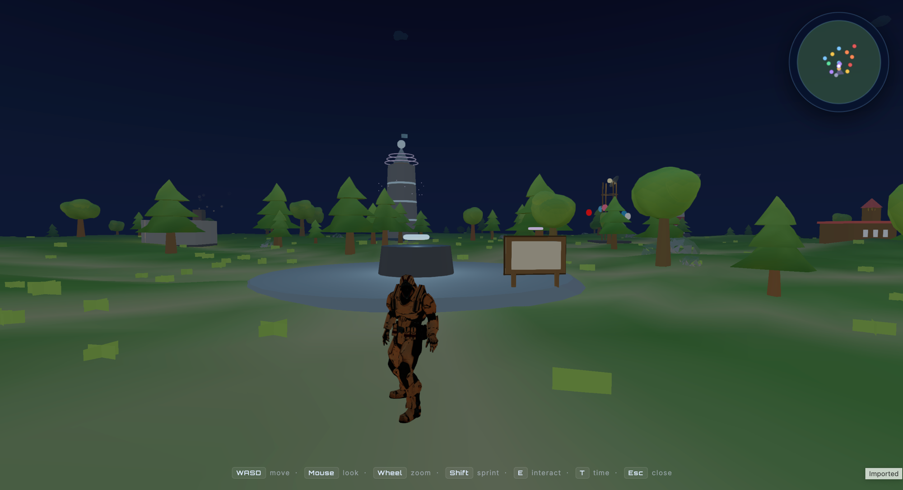

# Kaviyarasu - Plaza of Kaviyarasu

An explorable low-poly island, built in Three.js, that **is** the developer portfolio for Kaviyarasu (Senior Full Stack Engineer). Walk up to any landmark and it opens a dialogue with the matching resume section.

## Controls

**Desktop**

| Key | Action |
|---|---|
| `W A S D` / arrows | Move |
| `Shift` | Sprint |
| `Mouse` | Look (click canvas to lock) |
| `Wheel` | Zoom |
| `E` | Interact |
| `T` | Advance day/night cycle |
| `Esc` | Exit pointer-lock / close dialogue |

**Touch:** left-side joystick to move, `ACT` to interact, `RUN` to toggle sprint, right side of the screen for look.

Walking close to a landmark auto-opens its dialogue; walking away closes it. Audio unlocks on the first tap.

**URL params:** `?time=0.75` starts at night (`0` midnight · `0.25` morning · `0.5` noon · `0.7` dusk).

## Zones

| Landmark | Section |
|---|---|
| Plaza of Kaviyarasu | Intro / hub |
| Notice Board | Resume download |
| Skill Forge | Tech skills |
| GravityWrite Citadel | Featured project |
| GravitySocial Broadcast | Broadcast project |
| GravityAuth Gateway | Auth project |
| TransGenie Transport Hub | Transport project |
| Open-Source Temple | AI Agent (OSS) |
| 1CLX Workshop | 1CLX project |
| Freshnote Studio | Freshnote project |
| Library of Experience | Role timeline |
| Academy | Education + PHP certification |
| Lighthouse | Contact (email, phone, LinkedIn, GitHub) |
| Milestones Monument | 300K users, team lead, OSS package, etc. |

## Notes

- The Notice Board downloads `./Kaviyarasu Full Stack Engineer Resume.pdf`. The filename is hard-coded in `RESUME_HREF` (`js/config.js`) - replace the file to swap the download.
- Audio under `assets/audio/` is optional; missing files fail silently.
